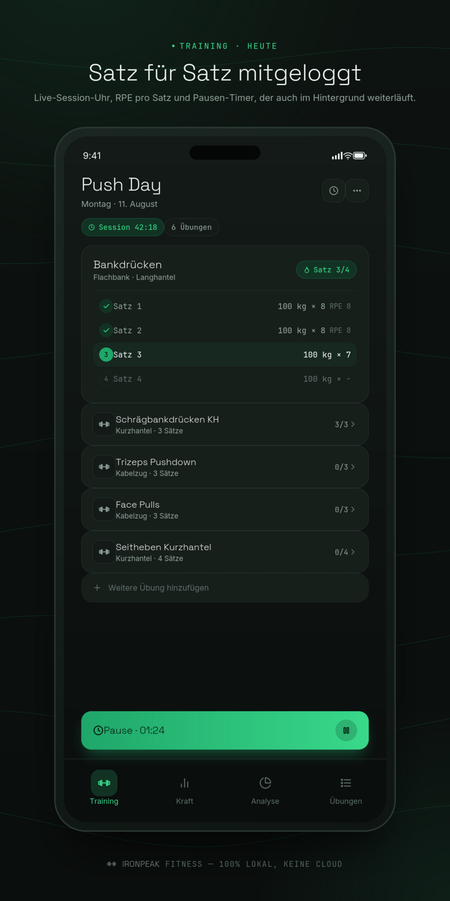
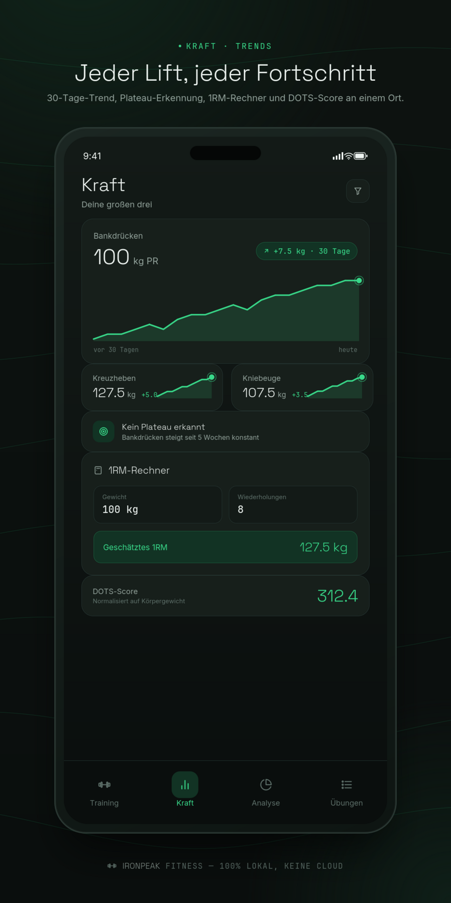
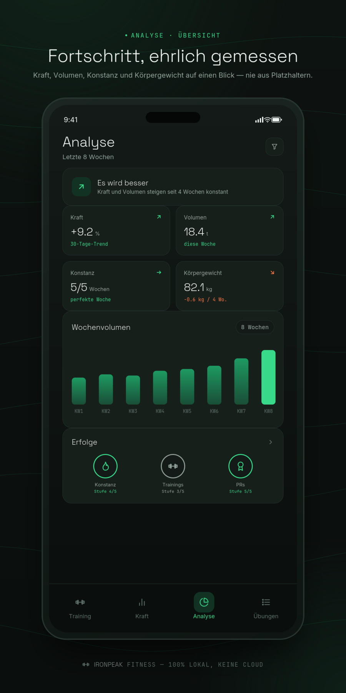
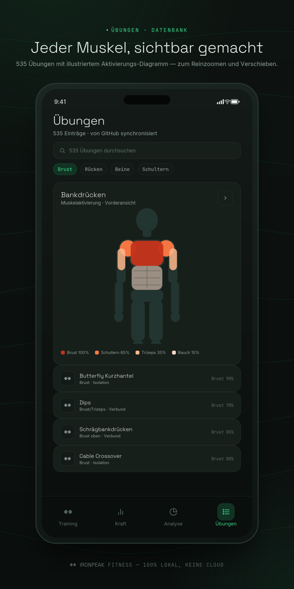

<div align="center">


# Ironpeak Fitness

**A workout planner, strength tracker, and deep analytics tool — built as a
native app for Android, iOS, Windows, and macOS.** All your data stays
**100% on your device**: no cloud, no server, no account, no tracking.

[](https://github.com/Sieder2009/GymTraker/actions/workflows/android.yml)
[](https://github.com/Sieder2009/GymTraker/actions/workflows/ios.yml)
[](https://github.com/Sieder2009/GymTraker/actions/workflows/windows.yml)
[](https://github.com/Sieder2009/GymTraker/actions/workflows/macos.yml)


</div>

---

##  Contents

- [What is Ironpeak Fitness?](#what-is-ironpeak-fitness)
- [Screenshots](#screenshots)
- [Features](#features)
  - [Training](#training)
  - [Strength](#strength)
  - [Analytics — its own tab](#analytics--its-own-tab)
  - [Exercise database](#exercise-database)
  - [More features](#more-features)
- [Download the app](#download-the-app)
- [Setup for developers](#setup-for-developers)
- [Configuration (`.env`)](#configuration-env)
- [Tests & code quality](#tests--code-quality)
- [Project structure](#project-structure)
- [Privacy](#privacy)
- [Credits](#credits)

---

##  What is Ironpeak Fitness?

Ironpeak Fitness is one single, native **Flutter app**. It is not a web app
with a separate build, and not an Electron app. One codebase runs on
**Android, iOS, Windows, and macOS**. The app is built around **four main
tabs**, so you don't need to search through many menus:

| Tab | What it's for |
|---|---|
| **Training** | Today's workout, guided sets, choose/create/import a plan |
| **Strength** | Bench Press / Deadlift / Squat: PR, history, trend, plain-language strength level, plate calculator |
| **Analytics** | The app's own stats and progress tab — see below |
| **Exercises** | A searchable database of 535 exercises with a muscle diagram |

The calendar, photo gallery, settings, backup, theme, and language are
**not** extra tabs at the bottom. They live together in one menu at the
top right of the Training tab. A row of 6+ icons would look messy on a
phone screen. One tap is enough to find everything.

##  Screenshots

<table>
<tr>
<td width="25%"></td>
<td width="25%"></td>
<td width="25%"></td>
<td width="25%"></td>
</tr>
<tr>
<td align="center"><sub><b>Training</b></sub></td>
<td align="center"><sub><b>Strength</b></sub></td>
<td align="center"><sub><b>Analytics</b></sub></td>
<td align="center"><sub><b>Exercises</b></sub></td>
</tr>
</table>

> Real captures from the iOS Simulator (iPhone 17, iOS 26).

## Features

<a id="training"></a>
###  Training

- Workout plans by weekday or rotation. Create them by hand, import a plan
  from your own log format, or pick one of eight built-in templates
  (shown during onboarding on first launch).
- Guided workouts with set-by-set input, a live session timer, and RPE
  tracking for each set. You can drag and drop exercises to reorder them
  during a session, without changing your saved plan.
- The rest timer uses real clock time, not a simple countdown. It syncs
  right away when you return from the background and sends a local push
  notification when it ends — it stays accurate no matter how long your
  phone was locked.
- Enter weight with a **slider or the keyboard** (comma or dot as the
  decimal separator).
- **Progressive overload suggestions.** Every exercise with logged history
  gets a plain-language nudge for what to try next session — double
  progression within its configured rep range: a full clear on reps bumps
  the weight (+2.5kg, +5kg for leg exercises), landing short of the top
  holds the weight and chases one more rep, and two missed sessions in a
  row suggest a deload instead of grinding at a stuck weight
  (`analytics/progression_engine.dart`). Built only from real numeric reps
  you logged — never a guess when a set only carries a '✓'/'x'/'m' marker.
- A training calendar with a monthly view and workout history, plus a
  photo gallery for your progress.
- Swipe between the four main tabs, or use the tab bar at the bottom.

<a id="strength"></a>
###  Strength

- Log your bodyweight, and your PR for Bench Press, Deadlift, and Squat —
  each with its own history and trend chart, plateau detection
  (`plateau_notice.dart`), and a quick "add today's entry" field right on
  the card.
- **Every lift gets a plain-language strength level** — Beginner through
  Elite, bodyweight-relative, with a progress bar toward the next level
  (`data/strength_standards.dart`). A bare DOTS score means nothing if
  you've never heard of Wilks/DOTS; "Fortgeschritten — 50% bis Sehr
  fortgeschritten" tells you something the moment you look at it.
- Total (Bench+Deadlift+Squat) and DOTS score still sit above that for
  anyone who does want the bodyweight-normalized comparison number
  competitive powerlifters use (`data/dots_score.dart`).
- A built-in **1RM calculator** (Epley formula) and **plate calculator**
  — given a target weight and bar weight, works out which plates go on
  each side from a standard kg or lb set (`data/plate_calculator.dart`),
  both reachable from the header, both pure scratchpad tools that don't
  read or write your logged data.

<a id="analytics--its-own-tab"></a>
###  Analytics — its own tab

A full tab with five sections. Every number and every chart comes from
your real logged data — **never from placeholder values**. If there isn't
enough data yet for an honest chart, the app shows a short message
instead of a made-up line (`DataQuality` in `analytics_engine.dart`).

- **Overview** — a plain-text status ("getting better" / "staying
  stable" / not enough data yet), plus strength, volume, consistency, and
  body weight trends at a glance, and a weekly volume chart for the last
  8 weeks.
- **Strength** — a 30-day trend chart for Bench Press, Deadlift, and
  Squat, with plateau detection. It compares your start and current
  numbers for every detected variant of these three lifts in your current
  plan (tap to open that PR entry). For the DOTS score, 1RM calculator,
  and plate calculator, see the [Strength tab](#strength) at the bottom
  of the app — this is the Analytics tab's own strength *trend* view, a
  different screen from the bottom "Strength" tab despite the shared
  name.
- **Volume** — total volume this week, workouts this week, and a bar
  chart of your weekly training volume.
- **Consistency** — your current and best training streak in days,
  workouts this month, and a bar chart of workouts per week.
- **Achievements** — four multi-level achievement paths (consistency,
  number of workouts, total volume, number of PRs). Each level is
  calculated live from your real data, not saved as a stored "unlocked"
  flag (`achievements_engine.dart`) — with a progress bar to the next
  level.

**You can log data here too, not just view it:** body weight has its own
history (`BodyWeightProvider`) and feeds directly into the DOTS score and
the body weight trend. You can log a new PR right from the Strength
section, without leaving the tab.

<a id="exercise-database"></a>
###  Exercise database

- 535 exercises, sorted by category (chest/back/shoulders/legs/arms/
  core/cardio), searchable and filterable in the "Exercises" tab. Each
  one has a muscle activation mapping based on exercise science
  (`lib/data/exercise_muscle_map.dart`).
- The database **loads live from GitHub** (it falls back to the last
  cached copy, or the built-in copy, if you're offline). Changes to
  `mobile/assets/exercises.json` in this repo update the app without a
  new release.
- **An illustrated muscle diagram for every exercise** (front/back view,
  male/female to match your athlete setting): a fully drawn body figure
  — hands, feet, and separate ab segments included — where every trained
  muscle group is colored from white (0%) through light red to dark red
  (100%), based on its exact activation level. Tap it for a full-screen
  view you can zoom and drag (`InteractiveViewer`).
- When you create your **own** exercise, you get the same editor: tap
  muscles directly on the figure (real hit-testing against the drawn
  outline, not a rough tap area) and set the activation level (0–100%)
  with a slider. Once it's set up, the same muscle diagram shows up when
  you do that exercise in a workout.

<a id="more-features"></a>
###  More features

- Health integration (Apple Health / Health Connect) for steps, weight,
  and writing back finished workouts.
- A daily training reminder (local notification, pick your own time).
- Automatic update checks against GitHub Releases, with background
  download — installing is still one clear tap.
- Backup and restore as a text export (clipboard) **or** as a file through
  the native share menu — for example straight into iCloud Drive or
  Google Drive, so you can move to another device. No account, no
  server: the file only goes where you send it, there's no automatic
  background sync.
- Custom primary and secondary colors (full color picker), automatic
  system light/dark mode with a manual override.
- 10 languages: German, English, Spanish, French, Italian, Portuguese,
  Dutch, Turkish, Polish, Russian.
- A guided onboarding flow on first launch, including the plan template
  picker.

##  Download the app

Every `vX.Y.Z` tag triggers an automatic build through GitHub Actions.
This does **not** happen on every push, so a full Android/iOS build
doesn't run on every single commit:

| Platform | Format | Workflow |
|---|---|---|
| Android | `.apk` | [`android.yml`](.github/workflows/android.yml) |
| iOS | unsigned `.ipa` (see the comments there about signing it yourself) | [`ios.yml`](.github/workflows/ios.yml) |
| Windows | a real installer (`ironpeak-fitness-windows-setup.exe`, built with Inno Setup — Start Menu shortcut, proper uninstall, replaces a running install in place), plus a portable `.zip` for anyone who'd rather not install anything | [`windows.yml`](.github/workflows/windows.yml) |
| macOS | unsigned, unnotarized `.zip` | [`macos.yml`](.github/workflows/macos.yml) |

You'll find finished builds on this repo's **[Releases page](../../releases)**
once a version tag exists. You can also trigger a manual
`workflow_dispatch` run (without a tag) any time, to quickly test a fix
without cutting a full release.

>  **Build status:** each workflow runs `flutter analyze` and
> `flutter test` before building anything, on every push, so a broken
> commit fails loudly instead of silently shipping. A tagged release
> (`vX.Y.Z`) produces `app-release.apk`,
> `ironpeak-fitness-ios-unsigned.ipa`, `ironpeak-fitness-windows-setup.exe`
> + `ironpeak-fitness-windows.zip`, and `ironpeak-fitness-macos.zip` —
> check the [Releases page](../../releases) for the actual files on the
> latest tag.

##  Setup for developers

You need the [Flutter SDK](https://docs.flutter.dev/get-started/install)
(stable channel).

```bash
cd mobile
flutter pub get
flutter gen-l10n        # generate translations from lib/l10n/*.arb
flutter run              # debug build on a connected device/emulator
```

Windows release build:

```bash
flutter build windows --release
# Output: mobile/build/windows/x64/runner/Release/ironpeak_mobile.exe
```

To also build the installer locally (Windows only, needs
[Inno Setup](https://jrsoftware.org/isinfo.php) installed):

```bash
iscc /DMyAppVersion=0.0.0 windows/installer/installer.iss
# Output: mobile/build/windows/x64/runner/ironpeak-fitness-windows-setup.exe
```

##  Configuration (`.env`)

Everything you can configure lives in [`mobile/.env`](mobile/.env), not
hardcoded in the app. This file has no secrets in it, so it's checked
into the repo on purpose (see `lib/config/app_config.dart` for the typed
way the app reads it):

| Variable | What it does |
|---|---|
| `GITHUB_OWNER` / `GITHUB_REPO` / `GITHUB_BRANCH` | Where the exercise database and update checks load from |
| `EXERCISE_DATABASE_PATH` | Path to `exercises.json` in the repo |
| `UPDATE_CHECK_ENABLED` / `UPDATE_CHECK_INTERVAL_HOURS` | Whether and how often the app checks for new releases |
| `SUPPORT_EMAIL` / `SUPPORT_PHONE` | Contact info shown on the Settings screen |

##  Tests & code quality

```bash
cd mobile
flutter analyze
flutter test
```

Every push runs through `flutter analyze` and `flutter test` in all four
platform workflows, before anything gets built. The calculation engines
behind the Analytics tab (`lib/analytics/analytics_engine.dart`,
`lib/analytics/achievements_engine.dart`, `lib/analytics/progression_engine.dart`)
and the Strength tab (`lib/data/dots_score.dart`,
`lib/data/strength_standards.dart`, `lib/data/plate_calculator.dart`) all
have their own dedicated test files under `mobile/test/` — pure
calculations, not just UI, so every number you see on either tab traces
back to a tested function.

##  Project structure

```
mobile/
  lib/
    analytics/          Pure calculation engine for trends/consistency/DOTS/
                         achievements — never a number without real data
    config/              Typed .env access (app_config.dart)
    data/                Constants, DOTS/1RM formulas, per-exercise muscle
                         activation, body figure atlas for the muscle
                         diagram, plan templates
    l10n/                ARB translation files (10 languages)
    models/              Data models (Exercise, Program, BigLift, …)
    overlays/             Full-screen screens (plan editor, workout, settings, …)
    screens/             The 4 main tabs (Training/Strength/Analytics/Exercises)
                         + calendar/gallery (reachable from the overflow menu)
    services/            External integrations (Health, GitHub, storage, update)
    state/               Providers (app-wide state via package:provider)
    theme/               Design system (colors, radii, typography)
    widgets/              Reusable UI building blocks (charts, editors, …)
  test/                  Unit/widget tests
  tool/seed_demo_data.dart  Developer script: fills demo data into the local DB
```

##  Privacy

The app stores everything only on your device (SQLite via `sqflite`).
There is no server and no account. The only network traffic is loading
the exercise database (it falls back to the built-in local copy when
offline) and the update check against the public GitHub API — you can
turn the update check off in `.env` (`UPDATE_CHECK_ENABLED`). The file
export in the backup menu uses your operating system's native share
menu (for example, to save the file to iCloud Drive or Google Drive).
This is something you choose to do — it is not an automatic cloud sync,
and the app itself never uploads anything on its own.

##  Credits

Special thanks to **[Plattnericus](https://github.com/Plattnericus)** for
his contribution to this project.

The illustrated body figure in the muscle diagram
(`mobile/lib/data/body_atlas*.dart`) is based on the SVG body model from
[react-native-body-highlighter](https://github.com/HichamELBSI/react-native-body-highlighter)
by Hicham ELABBASSI (MIT license, © 2022). The raw path data was carried
over 1:1 (TypeScript → Dart, geometry unchanged). The muscle group
mapping, the split of the deltoid into front/side heads and of
"upper-back" into upper back/lats, the activation color scale, the
hit-testing, and the caching are original work for this project.
